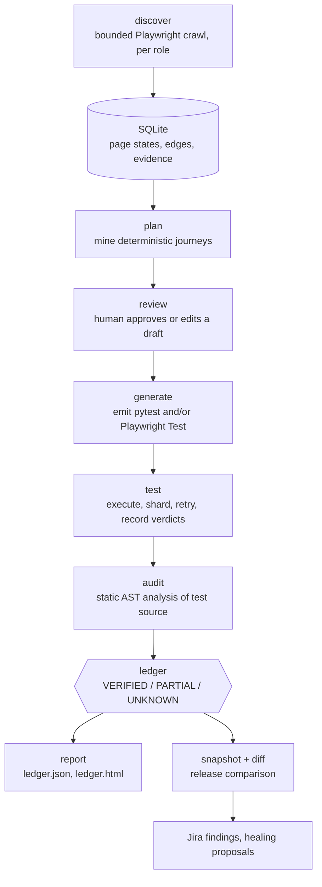
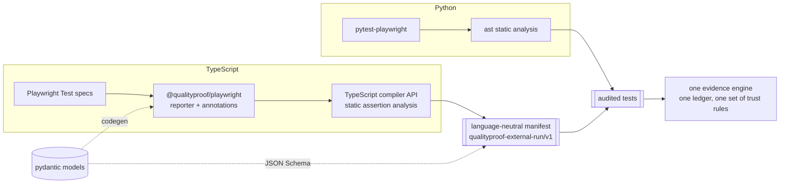

# Architecture

QualityProof separates three things that testing tools usually blur together:
**observing** an application, **deciding** what a test is entitled to claim, and
**executing** tests. Playwright is excellent at the first and third. This project
is about the second, and integrates rather than competes on the others.

## Evidence flow

Two properties are load-bearing:

- **A model never drives the browser.** Crawler actions are fixed code. An LLM may
  only *propose* scenarios, and every proposal is validated against the persisted
  discovery graph before a human sees it, then again before generation.
- **Runtime success is not provenance.** A passing test proves it passed. Whether
  it *proves a requirement* is decided by the audit rules, from source, without
  executing anything.

## Cross-language evidence

The direction of authority is deliberate and one-way. The pydantic models are the
contract; JSON Schema is exported from them; the TypeScript types are *generated*
from that schema, so a contract change becomes a compile error rather than a
silent divergence. Shared golden fixtures in `interop/fixtures/` are validated by
**both** pydantic and ajv, so neither language is trusted to describe the
contract alone.

There is no second engine. TypeScript evidence earns nothing for having run in a
real browser: an annotated test with resolvable provenance reaches `VERIFIED`, an
under-attributed one is `PARTIAL`, and an unannotated one is `UNKNOWN` — exactly
as for Python.

## Trust boundaries

| Boundary | Rule | Enforced in |
|---|---|---|
| Crawl navigation | Same-origin, allow-listed host, checked **before** network I/O | `discovery.py::is_allowed_request` |
| Crawl mutation | Only GET/HEAD/OPTIONS, plus one exact login method/path | `discovery.py::is_allowed_request` |
| Destructive controls | Labelled destructive links recorded as blocked unknowns; controls never activated | `discovery.py::is_destructive` |
| Model proposals | Route, requirement links and control semantics must match persisted discovery | `scenarios.py::validate_model_proposals` |
| AI assertions | Cannot become executable before human approval | `models.py::ScenarioSpec` |
| Custom tests | `scenarios/custom` is read-only to every command; digest checked before and after | `scenarios.py::assert_custom_unchanged` |
| Test arguments | Allow-listed pytest flags only | `execution.py::validate_extra_arguments` |
| Artifacts | Traces/screenshots off when secrets are present unless explicitly acknowledged, then quarantined | `security.py::ArtifactPolicy` |
| External manifests | Strict schema validation; `redacted=false` refused | `external.py::read_manifest` |
| Configuration | Secret-shaped keys rejected outright | `config.py::_reject_secret_keys` |

## Threat model

**In scope.** Accidental damage to a system under test by an automated crawler;
credential leakage into committed evidence; an LLM inventing a selector, route or
assertion; a benchmark flattering itself; a foreign runner injecting
unverifiable ledger rows.

**Out of scope.** A hostile system under test attacking the browser process;
malicious code in `scenarios/custom` (that directory is trusted, executable, human
-owned code and is documented as such); compromise of the host running
QualityProof.

**Explicit residual risks.**

1. A trace or screenshot cannot be redacted after capture. Authenticated capture
   is therefore opt-in and quarantined, never sanitised — the tool does not
   pretend otherwise.
2. `EvidenceRedactor` replaces known values and credential shapes. A secret that
   never appears in the environment cannot be recognised.
3. Static analysis proves what a test *claims*, not that the claim is correct.
   `VERIFIED` means traceable and attributable; it does not mean true.

## Why measurement is facet-attributed

Release comparison records seven independent facets per page state — title,
headings, forms, controls, status, accessibility, layout. A page-state difference
alone would say only "something changed here", which is enough to credit the
wrong cause: during development, `/products` changed because a navigation link
was removed, and a route-scoped match happily attributed that to a layout defect
living on the same route. Facet attribution makes a match require a cause that
could actually explain it, which makes matching strictly harder.

Two honest caveats. The defect-category rule that makes this strict lives in
`scripts/benchmark_demo.py` rather than in `src/`, so it is a property of the
self-scorer rather than of the product; and the facets are not fully independent —
`CONTROL_SELECTOR` includes `a[href]`, so a navigation change and a control change
both land in the `controls` bucket.

See [the evidence model](EVIDENCE_MODEL.md) for the full trust and
static-analysis boundary, and [the controlled demo](CONTROLLED_DEMO.md) for what
the benchmark does and does not claim.
